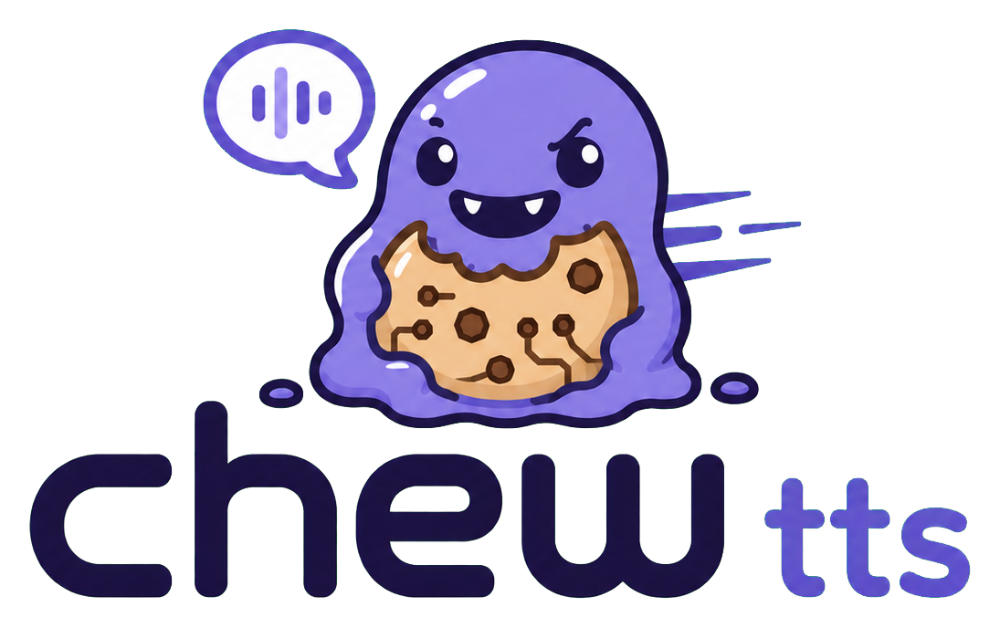

<p align="center">
  
</p>

<h1 align="center">Chew TTS</h1>

<p align="center">
  Native speech synthesis in one Rust binary, with CUDA kernels compiled for
  the GPU at startup.
</p>

<p align="center">
  <a href="https://github.com/KevinKickass/chew-tts/actions/workflows/build.yml"></a>
  <a href="LICENSE"></a>
  
  
  
</p>

Chew TTS is a native Rust and CUDA speech-synthesis engine built for
predictable VRAM usage, high throughput, and a single deployable binary. CUDA
kernels are compiled at startup with NVRTC for the GPU that is actually
present.

The project is a TTS-focused fork of
[Chew](https://github.com/KevinKickass/chew). It intentionally has its own
repository and release lifecycle: Fleet can deploy a small speech engine
without carrying an LLM API or llama.cpp dependency.

## Status

Qwen3-TTS is end-to-end usable. Native Kokoro and Chatterbox Multilingual V3
support is under active development.

Implemented:

- model-independent TTS request, audio, and capability types;
- memory-mapped native Safetensors access;
- Qwen3-TTS Base, CustomVoice, and VoiceDesign configuration parsing;
- validation of the talker and code-predictor geometry;
- inspection of real Hugging Face model directories;
- native F16 CUDA execution of a complete Qwen talker decoder layer;
- causal multi-token prefill and incremental decoding with a native KV cache;
- GPU-resident execution of all 28 talker layers without host round-trips;
- a native dense F16 decode GEMV path;
- GPU-resident execution of the five-layer Qwen code predictor;
- complete 15-codebook acoustic generation with GPU embeddings, deterministic
  argmax, and temperature/top-k sampling;
- reusable predictor KV/scratch sessions and exact GPU-resident Top-K sampling
  for the 2,048-token acoustic vocabulary;
- native decoding of all 16 codec codebooks into the 512-channel latent;
- the codec's causal pre-convolution and eight-layer transformer on CUDA;
- both 2x causal ConvNeXt codec upsampling stages;
- the complete BigVGAN waveform decoder, including SnakeBeta activations,
  dilated residual units, and all four upsampling blocks;
- joint multi-frame decoding with causal transformer attention and convolution
  history preserved across frame boundaries;
- mono 24-kHz PCM16 WAV output from the native codec path;
- direct code-predictor to continuous-codec integration;
- local Qwen2 byte-level BPE tokenization from `vocab.json` and `merges.txt`;
- native talker text/codec embeddings, SwiLU text projection, and semantic head;
- exact VoiceDesign ChatML/control-token prefill, persistent talker KV cache,
  autoregressive semantic/acoustic generation, and end-to-end WAV output;
- native CustomVoice speaker selection with optional instructions;
- native WAV decoding, 24-kHz resampling, Slaney log-mel preprocessing, and a
  CUDA ECAPA-TDNN speaker encoder for Base x-vector voice cloning;
- native SEANet/Transformer speech-tokenizer encoding, 16-codebook residual
  vector quantization, and Base ICL prompts with reference text;
- an eight-entry SHA-256 reference cache for speaker embeddings, waveforms,
  and ICL codec frames;
- PyTorch parity checks for real Qwen weights, RoPE, GQA, and cached decoding;
- sentence-aware long-request segmentation, allowing the advertised 4,096
  characters without weakening the per-segment codec-frame safety limit;
- native Kokoro config, PyTorch checkpoint, phoneme-token, and `.pt` voice-pack
  loading with real-storage validation;
- complete native Kokoro inference: shared ALBERT, GPU bidirectional LSTMs,
  duration and text encoders, style conditioning, F0/noise prediction, AdaIN
  decoder, Snake iSTFTNet generator, and 24-kHz waveform output with PyTorch
  parity;
- native Chatterbox Multilingual V3 T3, S3Gen, and voice-encoder artifact
  validation;
- GPU-resident execution of all 30 Chatterbox T3 Llama layers and final norm,
  with Llama 3 RoPE and persistent multi-token KV caches;
- native Chatterbox multilingual tokenization, speaker/emotion conditioning,
  Perceiver prompt encoding, CFG, and autoregressive speech-token generation;
- the complete native S3Gen token-conditioning encoder: lookahead convolution,
  6+4 relative-attention Conformer blocks, 2x upsampling, and the 80-bin flow
  projection, checked against the official FP16 PyTorch path on an RTX 3080;
- the complete GPU-resident S3Gen conditional-flow estimator with causal
  ResNet blocks, 64 attention/FFN blocks, skip connection, cosine Euler
  integration, and classifier-free guidance;
- the complete native HiFT neural-source-filter vocoder: F0 predictor,
  harmonic source, GPU upsampling and Snake ResBlocks, 16-point STFT/ISTFT,
  and 24-kHz waveform output.

Next:

- one CUDA graph for a complete 16-codebook audio frame;
- optimized one-pass model loading and GPU-resident sampling;
- arbitrary compressed reference-audio input in addition to native WAV;
- native Chatterbox reference-audio conditioning.

## Quick start

Build the production binary:

```bash
cargo build --release --locked -p chew-tts
```

Run an OpenAI-compatible server with any supported model directory:

```bash
./target/release/chew-tts serve /models/Kokoro-82M \
  --gpu 0 --host 127.0.0.1 --port 18001 --workers 2
```

Generate a WAV:

```bash
curl http://127.0.0.1:18001/v1/audio/speech \
  -H 'content-type: application/json' \
  -d '{
    "model": "tts-fast",
    "input": "Hello from Chew TTS.",
    "voice": "af_heart",
    "language": "en",
    "response_format": "wav"
  }' \
  --output speech.wav
```

Model weights are not included in this repository. Point the binary at a local
Hugging Face model directory containing the original model artifacts.

## Performance

Warm end-to-end measurements for every locally available model on an
RTX 3080 10 GB:

| Model | Mode | Load | VRAM | Audio | Median wall | RTF | Realtime |
| --- | --- | ---: | ---: | ---: | ---: | ---: | ---: |
| Kokoro-82M | fast voice | 0.95 s | 171 MiB | 9.475 s | 0.252 s | 0.0266 | 37.59x |
| Chatterbox Multilingual V3 | expressive | 3.90 s | 1,290 MiB | 6.440 s | 1.525 s | 0.2368 | 4.22x |
| Qwen3-TTS 1.7B VoiceDesign | designed voice | 4.14 s | 3,901 MiB | 8.320 s | 1.967 s | 0.2364 | 4.23x |
| Qwen3-TTS 1.7B CustomVoice | `serena` | 4.13 s | 3,948 MiB | 9.200 s | 2.148 s | 0.2334 | 4.28x |
| Qwen3-TTS 1.7B Base | cached ICL clone | 4.36 s | 4,040 MiB | 13.280 s | 3.191 s | 0.2403 | 4.16x |

All rows use the same English input, seed 4242, native mono WAV output, one
worker, one discarded warm-up, and the median of five sequential requests
over localhost. Timings include HTTP handling and the complete text-to-waveform
path, but exclude model loading and MP3 encoding. The card ran under its normal
desktop workload with CUDA 13.2 and driver 595.58. Base uses a 2.96-second
reference and measures the normal cached-reference path after warm-up. RTF is
wall time divided by generated audio duration, so lower is better.

### Audio samples

English is the default sample for every model. Multilingual engines also
include a German example:

| Model | English | German |
| --- | --- | --- |
| Kokoro-82M | [MP3](samples/kokoro-en.mp3) | — |
| Chatterbox Multilingual V3 | [MP3](samples/chatterbox-en.mp3) | [MP3](samples/chatterbox-de.mp3) |
| Qwen3-TTS 1.7B VoiceDesign | [MP3](samples/qwen3-voice-design-en.mp3) | [MP3, whispered](samples/qwen3-voice-design-de.mp3) |
| Qwen3-TTS 1.7B CustomVoice | [MP3](samples/qwen3-custom-en.mp3) | [MP3](samples/qwen3-custom-de.mp3) |
| Qwen3-TTS 1.7B Base | [MP3](samples/qwen3-base-en.mp3) | [MP3](samples/qwen3-base-de.mp3) |

### Kokoro concurrency

Warm Kokoro measurements for the same 2.525-second English sample:

| GPU | Workers | Requests/s | Audio seconds/s |
| --- | ---: | ---: | ---: |
| RTX 3080 10 GB | 1 | 15.9 | 40.2 |
| RTX 3080 10 GB | 2 | 21.6 | 54.6 |
| RTX 3080 10 GB | 4 | 23.9 | 60.3 |
| Tesla V100 16 GB | 1 | 10.6 | 26.8 |
| Tesla V100 16 GB | 3 | 16.5 | 41.6 |
| RTX A6000 48 GB | 1 | 13.1 | 33.0 |

The RTX 3080 produces a 17.9-second sample in about 0.51 seconds end to end
(RTF 0.028). Measurements include phonemization and raw 24-kHz output, but not
network transit or compressed-audio encoding. Staging-card measurements were
taken alongside other resident model contexts.

## Why a separate repository?

TTS and LLM serving share CUDA primitives, but not their product surface or
hot path. Qwen3-TTS performs one large talker step followed by 15 small
code-predictor steps for every 12.5 Hz audio frame. It also needs convolutional
audio decoders, resampling, phonemization, and audio encoders that an LLM
server does not need.

The fork currently retains Chew's proven LLM crates as implementation
references while the CUDA runtime is separated from GGUF-specific types. They
will leave the final TTS binary and eventually the workspace after the Qwen
path is verified.

## Workspace

```text
bin/
  chew-tts/             TTS CLI and, later, HTTP server
crates/
  tts-core/             common request, audio, and capability types
  safetensors/          mmap Safetensors access
  model-qwen3-tts/      Qwen configuration and inference
  model-kokoro/         Kokoro checkpoint, voice, and inference path
  model-chatterbox/     Chatterbox Multilingual V3 T3 and S3Gen path
  kernel/               inherited CUDA/NVRTC kernels
  vram/                 inherited VRAM ownership and budgeting
```

The inherited `gguf`, `engine`, and `server` crates are temporary references
and are not dependencies of the `chew-tts` binary.

## Inspect a model

```bash
CARGO_TARGET_DIR=/tmp/chew-tts-target \
  cargo run --release -p chew-tts -- \
  inspect /models/Qwen3-TTS-12Hz-1.7B-Base
```

Example:

```text
Qwen3-TTS 1b7 Base
talker: 28 layers, hidden 2048, 16 Q heads / 8 KV heads
code predictor: 5 layers, hidden 1024, 15 acoustic steps/frame
weights: 480 tensors in 1 file(s), 3.59 GiB
```

Inspect Kokoro and validate an official voice pack:

```bash
cargo run --release -p chew-tts -- \
  inspect-kokoro /models/Kokoro-82M \
  --voice /models/Kokoro-82M/voices/af_heart.pt \
  --phonemes 'həlˈoʊ wɜɹld!'
```

Inspect all Chatterbox Multilingual V3 components:

```bash
cargo run --release -p chew-tts -- \
  inspect-chatterbox /models/chatterbox-v3
```

Run the native Chatterbox T3 CUDA stack:

```bash
cargo run --release -p chew-tts -- \
  cuda-chatterbox-layer-smoke /models/chatterbox-v3 --gpu 0 --stack
```

Run the complete native S3Gen token-conditioning encoder:

```bash
cargo run --release -p chew-tts -- \
  cuda-chatterbox-s3-encoder-smoke /models/chatterbox-v3 --gpu 0 --tokens 257
```

The production path batches conditional and unconditional CFG evaluation,
uses batched cuBLAS/Tensor-Core attention, and lowers HiFT convolutions through
unfold plus GEMM. A warm RTX 3080 request generating 2.80 seconds of audio
completed in 0.845 seconds (RTF 0.30): approximately 0.14 seconds for prompt
prefill, 0.37 seconds for paired T3 generation, 0.26 seconds for the ten-step
flow, and 0.08 seconds for HiFT. The original correctness-first flow alone
took roughly 8.2 seconds for the same short-request geometry.

Run T3, S3Gen, and HiFT end to end:

```bash
cargo run --release -p chew-tts -- \
  cuda-chatterbox-generation-smoke /models/chatterbox-v3 \
  --language de --text 'Hallo aus der nativen Engine.' \
  --max-tokens 100 --flow-steps 10 --wav /tmp/chatterbox.wav
```

The HiFT path was checked against the official PyTorch implementation at every
major stage. The current native path produces finite, unclipped 24-kHz audio
and keeps the model resident between HTTP requests; startup and NVRTC
compilation are therefore excluded from the warm-request number above.

## CUDA validation

Compile the inherited kernels with NVRTC for the installed GPU:

```bash
CARGO_TARGET_DIR=/tmp/chew-tts-target \
  cargo run --release -p chew-tts -- cuda-smoke --gpu 0
```

Run one real Qwen talker decoder layer:

```bash
CARGO_TARGET_DIR=/tmp/chew-tts-target \
  cargo run --release -p chew-tts -- \
  cuda-layer-smoke /models/Qwen3-TTS-12Hz-1.7B-VoiceDesign \
  --gpu 0 --layer 0 --seq-len 4 --decode-split 2
```

An optional raw little-endian F32 output can be supplied with `--reference`.
The command then fails if CUDA and the reference differ beyond the configured
correctness tolerance. `--decode-split` fills the KV cache with a prompt prefix
and processes the remaining tokens individually.

Run the complete talker stack from a prepared hidden state:

```bash
CARGO_TARGET_DIR=/tmp/chew-tts-target \
  cargo run --release -p chew-tts -- \
  cuda-talker-smoke /models/Qwen3-TTS-12Hz-1.7B-VoiceDesign --gpu 0
```

On an RTX 3080, the initial dense F16 implementation loads the 28-layer talker
into approximately 2.7 GiB of VRAM and executes one synthetic decode token in
approximately 7 ms. The five-layer code predictor occupies another 172 MiB and
executes in approximately 0.7 ms per codebook step. A warm, complete
15-codebook predictor frame including projection, embeddings, heads, and GPU
argmax takes approximately 10 ms. Talker plus predictor therefore take roughly
17 ms per 80-ms audio frame before the speech codec.

Decode one complete codec frame through its quantizers, causal pre-convolution,
and eight-layer transformer:

```bash
CARGO_TARGET_DIR=/tmp/chew-tts-target \
  cargo run --release -p chew-tts -- \
  cuda-codec-latent-smoke /models/Qwen3-TTS-12Hz-1.7B-VoiceDesign/speech_tokenizer \
  --gpu 0 --transformer
```

This codec front end uses approximately 108 MiB of VRAM and takes approximately
0.8 ms per frame on an RTX 3080. Its output is checked against an independent
F32 PyTorch implementation; the measured maximum absolute delta is below
0.00005 for the documented validation frame.

Add `--upsample --repeats 10` to validate and benchmark both causal ConvNeXt
upsampling stages. After one cuBLAS warm-up pass, the complete path through the
four 1024-channel output steps takes approximately 1.1 ms per frame on the same
GPU. Against the independent F32 reference, the mean absolute delta is below
0.002.

Add `--audio --repeats 10` to run through the complete BigVGAN decoder and
produce one 1,920-sample frame at 24 kHz. The warm single-frame path takes
approximately 2.7 ms on an RTX 3080, including the codec front end. Dense
causal and transposed convolutions are lowered to Tensor-Core/cuBLAS GEMMs
instead of using scalar reduction kernels.

Decode several frames jointly and write a WAV file:

```bash
CARGO_TARGET_DIR=/tmp/chew-tts-target \
  cargo run --release -p chew-tts -- \
  cuda-codec-latent-smoke /models/Qwen3-TTS-12Hz-1.7B-VoiceDesign/speech_tokenizer \
  --gpu 0 --audio --frames 3 --repeats 10 --wav /tmp/codec.wav
```

The multi-frame path preserves the causal transformer and convolution context
instead of joining independently decoded 80-ms chunks. Three frames take
approximately 4.3 ms warm for 240 ms of output on an RTX 3080 (codec RTF 0.02).
The original scalar CUDA path was checked against the independent F32
reference. On a 32-frame validation waveform, the GEMM path differs from that
scalar baseline by 0.00018 on average and 0.0036 at maximum, while reducing
codec latency from approximately 726 ms to 32 ms.

Run the predictor-to-codec integration without manually supplying acoustic
codebooks:

```bash
CARGO_TARGET_DIR=/tmp/chew-tts-target \
  cargo run --release -p chew-tts -- \
  cuda-predictor-codec-smoke /models/Qwen3-TTS-12Hz-1.7B-VoiceDesign \
  --gpu 0 --semantic-token 42 --frames 3 --wav /tmp/predictor-codec.wav
```

This currently uses deterministic prepared talker hidden states to exercise
the boundary. On an RTX 3080, predictor plus codec occupy approximately
589 MiB and generate three distinct acoustic code frames plus 240 ms of valid
PCM audio end to end.

The local tokenizer matches Hugging Face token IDs without requiring Python or
network access:

```bash
CARGO_TARGET_DIR=/tmp/chew-tts-target \
  cargo run --release -p chew-tts -- \
  tokenize /models/Qwen3-TTS-12Hz-1.7B-VoiceDesign "Hallo Welt!"
```

`cuda-talker-frontend-smoke` validates token embeddings, the two-layer SwiLU
text projection, codec control-token embeddings, and the semantic codec head.
The frontend occupies approximately 684 MiB on an RTX 3080. Against the
independent F32 PyTorch path, projected text has a mean absolute delta below
0.000008 and both paths select the same semantic argmax token.

Run the complete native VoiceDesign path:

```bash
CARGO_TARGET_DIR=/tmp/chew-tts-target \
  cargo run --release -p chew-tts -- \
  cuda-voice-design-smoke /models/Qwen3-TTS-12Hz-1.7B-VoiceDesign \
  --gpu 0 \
  --language german \
  --text "Guten Abend, schön dass du da bist." \
  --instruction "A quiet, breathy German female whisper." \
  --max-frames 2048 \
  --seed 42 \
  --wav /tmp/voice-design.wav
```

The command uses the model's production sampling defaults: temperature 0.9,
top-k 50, and semantic repetition penalty 1.05. Generation normally ends at
codec EOS; `--max-frames` is only a safety limit and reports an error instead
of silently presenting truncated audio. On an RTX 3080, the first
correctness-oriented implementation occupies approximately 3.9 GiB of VRAM
and generates 0.96 seconds of sampled audio in approximately 0.77 seconds
(RTF 0.80). The optimized binary maps and uploads the complete model in
approximately 4.2 seconds from a warm filesystem cache. Debug builds are not
representative because their element-wise F16 conversion is intentionally
unoptimized.

A 48-frame stability run produces 3.84 seconds of continuous audio in
approximately 2.14 seconds (RTF 0.56). Convolution kernels place the audio
timeline on CUDA's large X grid dimension, so output is not limited by the
65,535-block Y dimension once a waveform exceeds roughly 2.7 seconds.

By default, generated codes are drained through a bounded 32-frame codec
buffer with four previous transformed frames of causal context. The codec
transformer's KV cache persists across chunks, so each codec frame passes
through the transformer exactly once. Only the inexpensive causal audio tail
is replayed to preserve the waveform boundary. Four context frames match a
64-frame overlap within one PCM16 level after the boundary in validation,
while avoiding the large cost of repeatedly decoding 64 old frames.

PCM chunks are written immediately through a streaming WAV sink; generated
audio is not accumulated in RAM, and the header is finalized at EOS. A
33-frame boundary-stress run takes approximately 1.53 seconds for 2.64 seconds
of audio on an RTX 3080 (RTF 0.58). Its maximum deviation from full-sequence
output is 26 PCM16 levels and only 14 around the chunk boundary. Use
`--chunk-frames 0` for exact full-sequence decoding.

The current optimized acoustic path sustains roughly 95% GPU utilization on an
RTX 3080. Exact semantic and acoustic Top-K 50 sampling, including semantic
token filtering and repetition penalty, stays on the GPU. Tensor-Core/cuBLAS
convolution lowers the complete 32-frame codec from approximately 726 ms to
32 ms. A 2.64-second VoiceDesign boundary-stress run now takes approximately
0.73 seconds total inference (RTF 0.28), including roughly 60 ms of interleaved
codec work. Repeated runs with the same seed produce byte-identical WAV files.

A 279-frame stability run crosses eight 32-frame chunk boundaries, reaches
model EOS normally, and produces 22.32 seconds of audio in approximately
5.42 seconds (RTF 0.24). The process remains at roughly 3.95 GiB of VRAM.
A separate 256-frame safety-limit run writes a valid 20.48-second WAV and
returns an explicit truncation error instead of silently accepting it.

## HTTP server

Run a persistent worker for a VoiceDesign, CustomVoice, or Base checkpoint:

```bash
CARGO_TARGET_DIR=/tmp/chew-tts-target \
  cargo run --release -p chew-tts -- \
  serve /models/Qwen3-TTS-12Hz-1.7B-VoiceDesign \
  --gpu 0 --host 127.0.0.1 --port 18001
```

The server loads the model once, owns CUDA from a dedicated worker thread, and
places concurrent requests in a bounded queue. It exposes:

- `POST /v1/audio/speech` (OpenAI-compatible synchronous speech);
- `GET /v1/models`;
- `GET /health`;
- `POST /internal/audio/raw` (24-kHz mono float32 for SimpleLLM/Fleet).

VoiceDesign uses the optional `instruct` field. `instruction` and OpenAI's
`instructions` are accepted as aliases; if none is present, `voice` may
contain a free-form voice description. CustomVoice accepts Qwen speaker names
(`serena`, `vivian`, `uncle_fu`, `ryan`, `aiden`, `ono_anna`, `sohee`,
`eric`, and `dylan`) and maps the common OpenAI voice names onto them.

Base cloning accepts the non-OpenAI `reference_audio` extension as a base64
WAV or WAV data URL. An instruction can be supplied at the same time. Without
`reference_text`, the engine uses x-vector-only cloning. Supplying the exact
transcript in `reference_text` enables the stronger ICL path with native
speech-tokenizer codes. Reference extraction is completely native; an
end-to-end ICL request producing 4.24 seconds of audio takes approximately
1.16 seconds on an RTX 3080. Reused reference audio is cached by SHA-256; in a
short validation request this reduced wall time from 0.59 to 0.38 seconds.
A longer Base ICL stability run reached EOS after 291 codec frames and produced
23.28 seconds of cleanly framed audio in 5.81 seconds wall time (RTF 0.25).
Reference WAVs are limited to 60 seconds and decoded payloads to 32 MiB.

Inputs up to 4,096 characters are split at sentence boundaries into bounded
synthesis sessions and concatenated before the requested encoding step. The
2,048-frame limit remains a safety cap for each segment. A local Base 1.7B
regression test generated 223.9 seconds of valid WAV from exactly 4,096
characters in 53.96 seconds on an RTX 3080 instead of failing at the old
single-session frame limit.

Supported `response_format` values are `wav`, `pcm`, `mp3`, `opus`, `aac`,
and `flac`. Compressed formats and non-default `speed` use FFmpeg.

```bash
curl http://127.0.0.1:18001/v1/audio/speech \
  -H 'content-type: application/json' \
  -d '{
    "model": "tts-voice-design",
    "input": "Guten Abend. Schön, dass du da bist.",
    "voice": "alloy",
    "language": "de",
    "instruct": "A quiet, warm and natural German female voice.",
    "response_format": "mp3"
  }' \
  --output speech.mp3
```

Responses include `server-timing`, `x-sllm-audio-duration-ms`, and
`x-sllm-generation-frames`. On an RTX 3080, two sequential HTTP validation
requests completed without model reload; the WAV response was byte-identical
to the validated CLI output.

For a Fleet GPU host, the same native engine can speak the existing
JSON-over-TCP worker protocol directly:

```bash
chew-tts fleet-serve /models/Qwen3-TTS-12Hz-1.7B-Base \
  --gpu 0 --host 0.0.0.0 --port 18001
```

Each connection carries one JSON request (Fleet's `text` field is accepted as
an alias for `input`) and returns mono 24-kHz `f32le` samples. Voice,
instruction, reference audio, reference transcript, language, sampling, and
speed fields use the same native synthesis path as HTTP. This mode has no
Python or PyTorch runtime dependency. A local RTX 3080 protocol test generated
4.16 seconds of audio in about 1.1 seconds; `speed: 2.0` returned the expected
2.08-second raw stream.

Fleet can opt into progressive framed output by adding
`"_fleet_stream": true`. The response begins with `FTS1`, followed by frames
containing a one-byte type, a little-endian `u32` payload length, and the
payload. Type `1` contains `f32le` audio, type `2` marks successful completion,
and type `3` contains a UTF-8 error. Long input is emitted immediately after
each existing synthesis segment instead of being buffered until the entire
request completes. The legacy request format remains raw and unframed.

On an RTX 3080, a 45.675-second Kokoro result arrived in three progressive
segments: first audio after 2.586 seconds and completion after 5.572 seconds.
This is segment-level streaming; model-specific codec-frame streaming can use
the same wire format later without changing Fleet or client WebSockets.

## Requirements

- NVIDIA GPU with compute capability 7.0 or newer
- CUDA toolkit with NVRTC
- Rust 2024 edition

F16 is the common correctness baseline for V100 and A6000. BF16 and
architecture-specific fast paths are enabled only after output parity.

## References and licensing

Chew TTS is MIT licensed. Qwen3-TTS porting behavior is checked against the
official implementation and the pinned MIT Rust reference documented in
[docs/PORTING_QWEN3_TTS.md](docs/PORTING_QWEN3_TTS.md).
